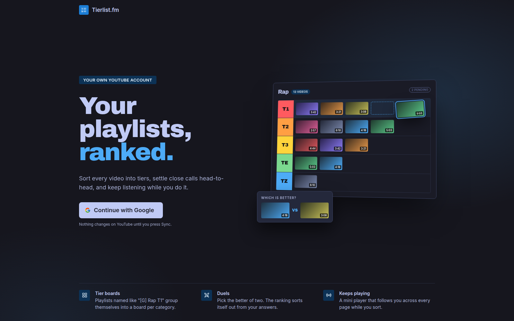

<div align="center">

# Tierlist.fm

**Your YouTube playlists, ranked.**

Sort every song into tiers, settle close calls head-to-head, and keep listening while you do it -
on top of the YouTube account you already have. Self-hosted, free for personal use.

[](LICENSE)




</div>

## Why

A YouTube playlist is a flat list. After a few hundred songs, "which of these do I actually
love?" has no answer - you can't rank, you can only scroll.

Tierlist.fm turns your playlists into a **tier list**: `T1` for the songs you'd defend to the
end, down to `TZ` for the ones you're keeping out of habit. The tiers **are** YouTube
playlists (`Rap T1`, `Rap T2`, ...), so nothing is locked into this app - rank here, and
every YouTube / YouTube Music device you own plays the result.

## Features

**Tier boards** - Playlists named by your template (`Rap T1` ... `Rap TZ`) group themselves
into one board per category. The whole board fits on one screen as album-art tiles; drag a
song between tiers, or onto the always-visible Tier Rail.

**Duels** - Can't decide between two songs? Pick the better of two, over and over, and the
ranking sorts itself out. Three strategies: a tier-aware merge that uses your existing tiers
to ask far fewer questions, a full re-sort, or Elo.

**A player that never stops** - A YouTube-Music-style player with a real queue (play next,
add to queue, shuffle, repeat). Minimize it to a mini bar or a floating corner; it keeps
playing as you move between boards, and you can rate the playing song with `Shift+1-5`.

**To-do triage** - Save new songs to a `TODO` playlist on your phone, then hit Triage: it
plays them one by one, and rating the current song files it and moves on to the next.

**Add songs by link** - Paste one or more YouTube / YouTube Music links anywhere (`Ctrl+V`);
the board is guessed from the artist, and one key puts the song in a tier.

**Safe by design** - Every edit is staged locally with undo (`Ctrl+Z`, 50 steps). Nothing
changes on YouTube until you press **Push to YouTube**, which adds the video to its new
playlist *before* removing it from the old one. Duplicate copies across tiers are cleaned up
automatically.

**Keyboard-first** - Command palette (`Ctrl+K`), Vimium-style navigation (`f` link hints,
`g h` home, `/` search), and a shortcut for nearly everything (`?` lists them).

**Yours to style** - 6 themes (Tokyo Night, Dracula, Solarized Light, ...), 8 accents, 3
tier palettes. Settings follow your Google account to any browser.

**Private by default** - Only playlists that match your naming template ever appear in the
app; everything else in your account stays invisible.

The full list, page by page, is in [docs/features.md](docs/features.md).

<!-- Screenshots of the signed-in app. Save them in docs/screenshots/ and uncomment:

## Screenshots

| Tier board | Duel |
|---|---|
|  |  |
| **Player & queue** | **Settings** |
|  |  |
-->

## How it works

A **naming template** (Settings -> Playlist naming) decides which playlists are tiers:

| Template | Matches |
|---|---|
| `{category} {tier}` (default) | `Rap T1`, `Lo-fi TZ` |
| `[{tag}] {category} {tier}` | `[G] Rap T1` |
| `[Tierlist.fm] {category} {tier}` | `[Tierlist.fm] Rap T2` |

Tiers are `T1`, `T2`, `T3`, `TE`, `TZ`, plus an unranked `TODO` list per board. The app
auto-detects the template that fits your existing playlists, and can rename them all on
YouTube if you switch templates (with a preview and a quota estimate first). Create a new
board from Home -> **New tier list**.

## Self-host it

You need Docker and a Google Cloud project (free) for the YouTube API.

### 1. Google OAuth credentials

1. In the [Google Cloud Console](https://console.cloud.google.com/), create a project.
2. Enable the **YouTube Data API v3** (APIs & Services -> Library).
3. Set up the consent screen (Google Auth Platform -> **Audience**): user type *External*, and
   add every Google account that will log in under **Test users**. Under **Data access**, add
   the scopes `openid`, `profile` and `.../auth/youtube.force-ssl` (read/write - needed to move
   songs between playlists).
4. **Clients -> Create client**: type *Web application*, authorized redirect URI
   `http://localhost:48123/login/oauth2/code/google`.
5. Copy the **Client ID** and **Client Secret**.

### 2. Configure

```bash
cp .env.example .env   # then paste GOOGLE_CLIENT_ID and GOOGLE_CLIENT_SECRET into .env
```

### 3. Run

```bash
docker compose up -d --build
```

Open **http://localhost** and continue with Google. That's it - Postgres (for your settings)
comes up alongside, and the schema is created on first start.

On Google's consent screen, **tick the YouTube permission** - if it's left unticked, the app
can't read your playlists and tells you to log in again.

<details>
<summary>Development setup, tests, running without Docker</summary>

Live-reload dev stack (source mounted into the containers):

```bash
docker compose -f docker-compose.local.yml up
```

Backend tests - unit + integration against a throwaway Postgres (needs Docker):

```bash
cd backend && mvn verify
```

Without Docker - the backend needs a Postgres at `localhost:5432` (db/user/password `yt`;
override with `DB_URL`, `DB_USER`, `DB_PASSWORD`):

```bash
cd backend && export $(grep -v '^#' ../.env | xargs) && mvn spring-boot:run
cd frontend && npm install && npm run dev
```

</details>

<details>
<summary>Troubleshooting</summary>

- **Stuck loading / "wasn't given access to your YouTube account"** - log in again and tick
  the YouTube permission on Google's screen.
- **"Access blocked" on login** - while the consent screen is in *Testing* mode, only
  accounts listed under Test users can log in.
- **Google shows a generic "Something went wrong"** - try a private window; an ad blocker or
  privacy extension is usually the cause.
- **"Daily quota used up"** - the YouTube API allows 10,000 units a day per Google Cloud
  project; it resets at midnight Pacific time.
- **Logged out after an update** - sessions are kept in memory, so restarting the backend
  logs everyone out.

</details>

## Built with

React 19 + Vite, [Mantine](https://mantine.dev), Redux Toolkit, TanStack Query - Spring Boot 3
(Java 21), Spring Security OAuth2, Postgres 17 + Flyway - the YouTube Data API v3. Everything
runs in Docker Compose.

## Contributing

Issues and pull requests are welcome. The repo is trunk-based: branch from `main`
(`feat/*`, `fix/*`, ...) and open a PR into `main`. See [CONTRIBUTING.md](CONTRIBUTING.md) for
the commit style and release process.

## License

[Business Source License 1.1](LICENSE) - free to self-host for your own personal,
non-commercial use; offering it as a hosted or paid service needs permission. Each version
becomes MIT-licensed four years after its release.
